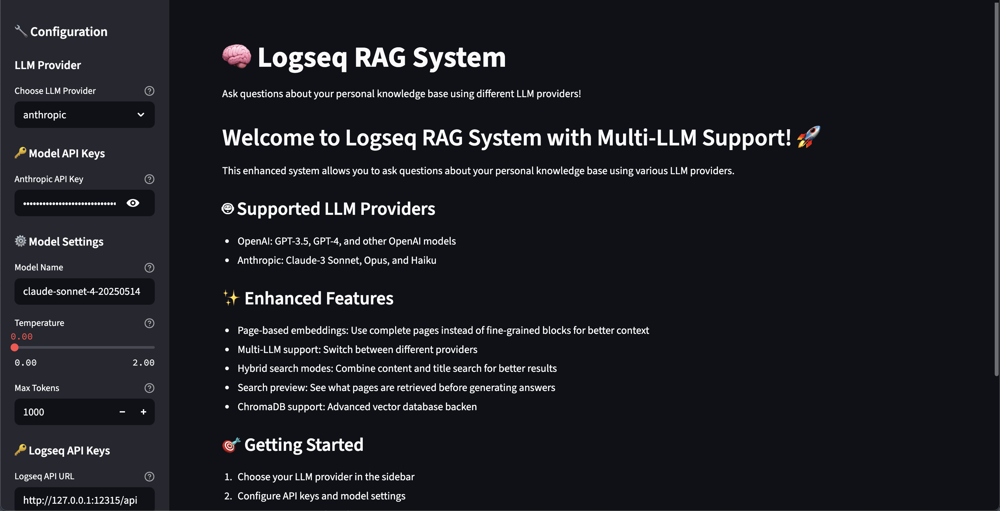
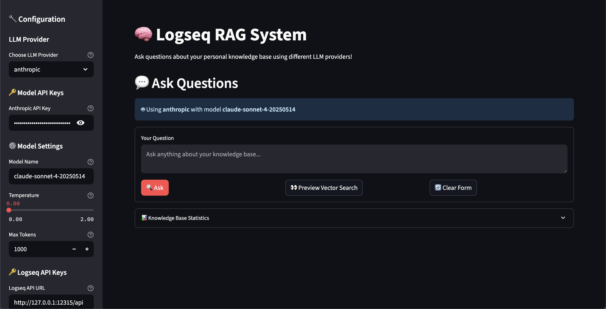
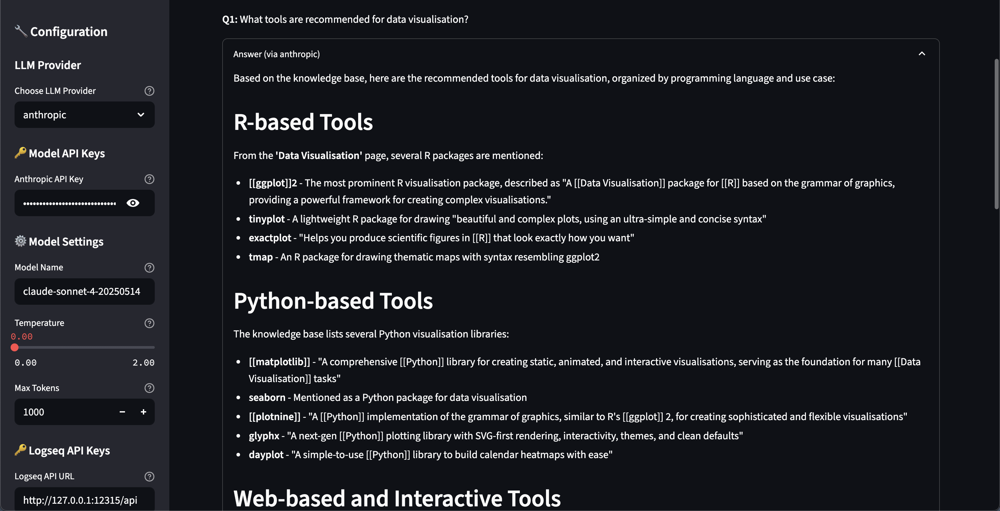
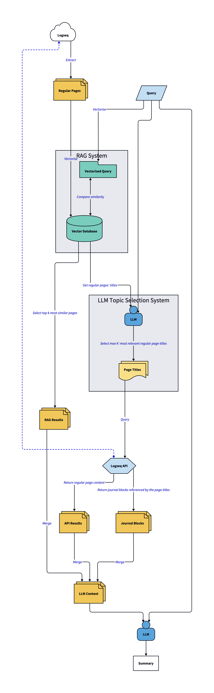
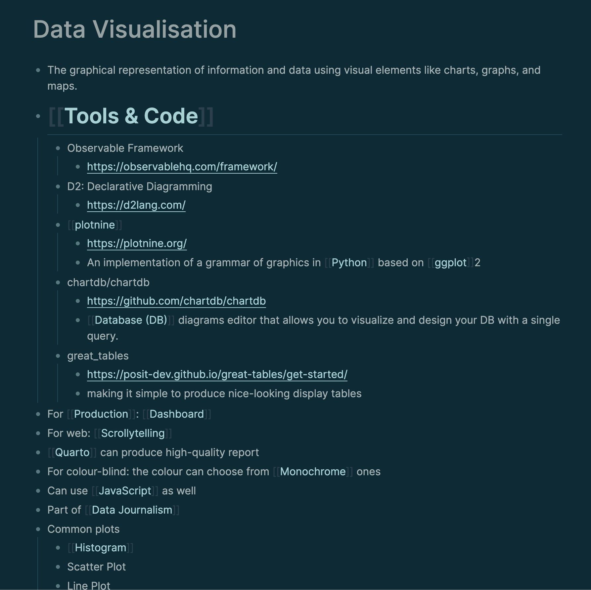
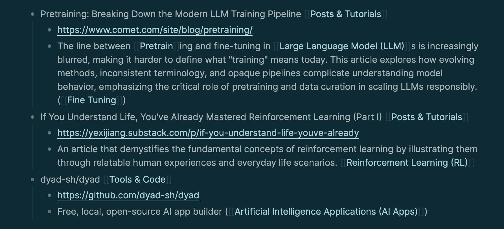

# Logseq RAG

RAG System for Logseq Knowledge Base.

## Welcome to Logseq RAG System with Multi-LLM Support!
        
This enhanced system allows you to ask questions about your personal knowledge base using various LLM providers.

### Supported LLM Providers

- OpenAI: GPT-3.5, GPT-4, and other OpenAI models
- Anthropic: Claude-3 Sonnet, Opus, and Haiku

### Enhanced Features

- Page-based embeddings: Use complete pages instead of fine-grained blocks for better context
- Multi-LLM support: Switch between different providers
- Hybrid search modes: Combine content and title search for better results
- Search preview: See what pages are retrieved before generating answers
- ChromaDB support: Advanced vector database backend


## Use Cases

You can use the Logseq RAG system:

- To find information across your entire knowledge base
- To explore your notes in a more interactive way
- To compare different concepts and ideas

But,

- Not to explain the concepts in depth (Use it to find related notes then read them by yourself or ask another LLM for summary)
- Not to find exact content (Use `query` function in Logseq instead)

## Quick Setup Guide - With Docker

> [!IMPORTANT]  
> Prerequisites:
> * Having `docker`, `docker-buildx` installed.
> * Having `Docker Desktop` or `Orbstack` (recommended) installed.

1. Clone the repository
2. Build the Docker image
   ```bash
   docker build -t logseq-rag:latest .
   ```
3. Run the Docker container
   ```bash
   docker run --rm -p 8501:8501 --mount type=bind,src=/YOUR/LOGSEQ/DIRECTORY,dst=/app/logseq --network host logseq-rag:latest
   ```

> [!Note]
> Replace `/YOUR/LOGSEQ/DIRECTORY` with the path to your Logseq directory.
>
> If you set `dst` as `/app/logseq`, the Logseq directory path will be `/app/logseq`.


## Quick Setup Guide - Without Docker

> [!IMPORTANT]
> Prerequisites:
> * Having `uv` installed.

1. Clone the repository into your project directory
2. Create a virtual environment in your project directory
   ```bash
   uv init
   ```
3. Install the required dependencies
   ```bash
   uv sync --frozen
   ```
4. Run the script
   ```bash
   uv run streamlit run src/app.py
   ```

## Getting Started

> [!IMPORTANT]
> Before using this system, ensure that Logseq is running and the API function is enabled.

1. Choose your LLM provider in the sidebar
2. Configure API key and model settings
3. Configure your Logseq API key and database retrieval options
4. Set your Logseq database location
5. Initialize the system to build embeddings
6. Start asking questions!
7. (Optional) Preview the vector database search results using `🔍 Vector Search Preview` button.


> [!Note]
> It takes longer to run for the first time because it needs to download a sentence transformer.

## Screenshots

Home Page



Query



Result



## System Architecture



## Sample Logseq Pages

Regular Page



Journal Page


